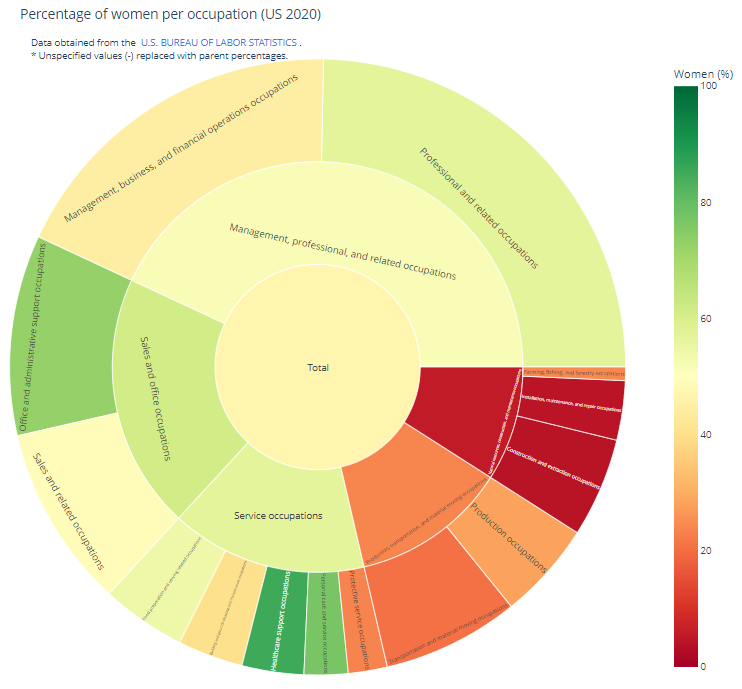
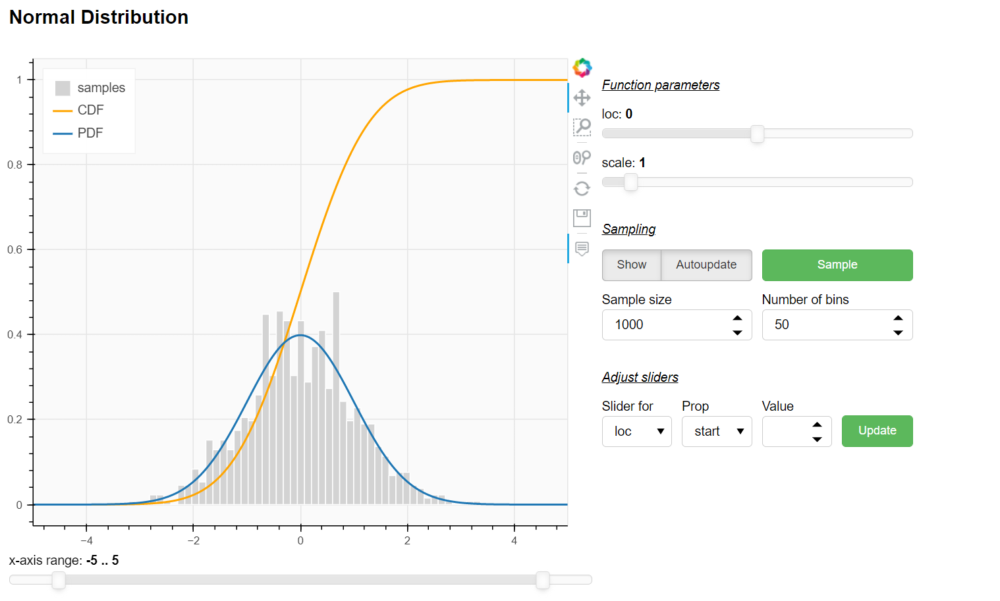

# viz: Collection of (interactive) data visualizations

## Women (in %) per occupation: sunburst plot of US 2020 labor data

  

## Probability distributions with Bokeh and SciPy
I host some interactive [discrete](http://curiousape.de:5006/distributions/discrete) and [continuous](http://curiousape.de:5006/distributions/continous) on my not so powerful server. 
However, any univariate probability distribution may be passed.

    

