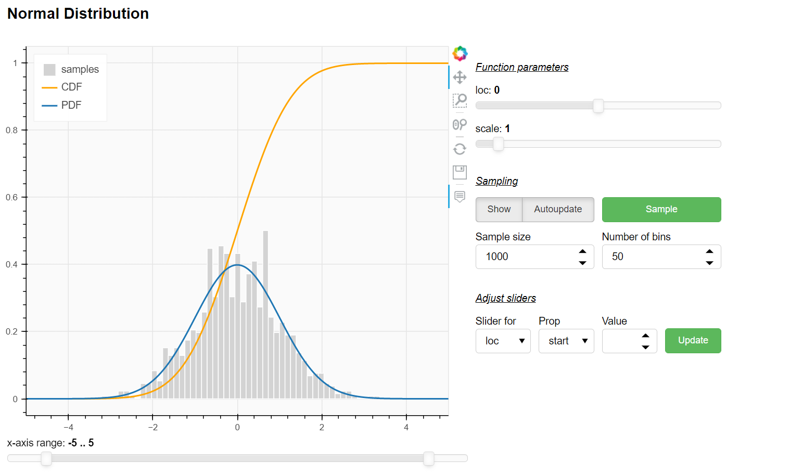

# probability-distributions
Interactive probability distributions using SciPy and Bokeh. Note that app must be run on server to allow for Python callbacks.

## how to use
Any continous or discrete probability distribution may be passed by specifying `sample_func`, `pdf`, and `cdf` for continous and `pmf` and `cdf` for discrete distributions and args/kwargs as Sliders. For example, the distributions from scipy.stats can be visualized easily:
```python
from scipy.stats import norm
from bokeh.models import Slider
from bokeh.plotting import curdoc

from distributions import BokehContDist
normal = BokehContDist(
    norm.rvs, 
    norm.pdf, 
    norm.cdf, 
    name="Normal Distribution",
    loc=Slider(start=-10, end=10, value=0, step=.5, title="loc"),
    scale=Slider(start=0.1, end=10, value=1, step=.1, title="scale"),
)
curdoc().add_root(normal.get_layout())
```
which results in (click on image to get to interactive app as iframe html tag does not work with GitHub flavored markdown):

[](http://curiousape.de:5006/distributions/continous)
